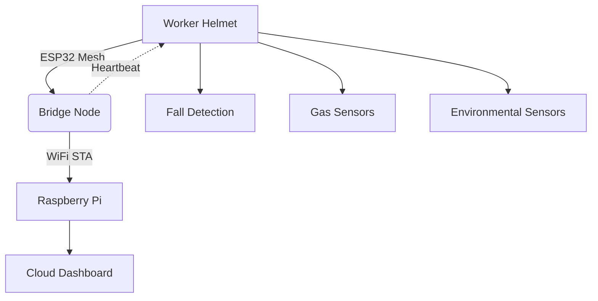

# SafeHat WorkNet: Smart Safety Helmet System with Self-Healing Mesh

  
  
  
  


**SafeHat WorkNet** revolutionizes workplace safety through an intelligent helmet system featuring environmental monitoring, real-time alerts, and a resilient mesh network. Designed for industrial environments with 4-node ESP32 clusters.

---

## Key Innovations 🚀

### 1. **Advanced Node Identification System**
- **MAC-Based Naming**: Unique identifiers like `SafeHat-A3B4` derived from ESP32 MAC addresses
- **Hybrid Identification**:
  - Human-friendly names (e.g., `SafetyHat-C5D6`)
  - Full MAC addresses (e.g., `A1:B2:C3:D4:E5:F6`)
  - 64-bit Chip ID fallback

### 2. **Intelligent Mesh Networking**
- **RSSI-Based Bridge Election**:
  - Dynamic leader selection using WiFi signal strength
  - Hysteresis threshold prevents network flapping
  - Heartbeat monitoring (2s intervals)
- **Self-Healing Architecture**:
  - Automatic rerouting in <5s node failure
  - Graceful bridge handoff protocol

### 3. **Enhanced Diagnostic Logging**
- **Color-Coded Serial Output**:
  ```bash
  [BRIDGE][SafeHat-A3B4][INFO] Forwarding message to server
  [NODE][SafeHat-C5D6][ERROR] Mesh connection lost!
  ```
- **Network Status Reports**:
  - Node count
  - RSSI levels
  - Bridge status
  - IP/MAC addresses

---

## Technical Architecture 🏗️



---

## Core Features 🔍

### 1. **Sensor Suite**
| Sensor Type          | Detection Range         | Update Frequency |
|----------------------|-------------------------|------------------|
| BME680 (Env)         | -40°C to +85°C          | 2s               |
| MPU6050 (Motion)     | ±16g, ±2000°/s          | 100ms            |
| MQ-2 (Gas)           | 300-10000ppm LPG        | 5s               |
| GPS NEO-6M           | ±1.5m accuracy          | 1s               |

### 2. **Network Specifications**
- **Protocol**: IEEE 802.11n (2.4GHz)
- **Max Nodes**: 4 (optimized for latency)
- **Data Rate**: 150Mbps (theoretical)
- **Range**: 50m line-of-sight
- **Security**: WPA2-PSK + Message CRC

---

## Setup Guide ⚙️

### Hardware Requirements
- 4× ESP32-WROOM-32D modules
- Safety helmet (ANSI Z89.1 certified)
- LiPo battery (3.7V 2000mAh minimum)
- See full [Parts List](parts-list.csv)

### Firmware Configuration
1. **PlatformIO Settings**:
   ```ini
   [env:esp32dev]
   platform = espressif32
   board = esp32dev
   monitor_speed = 115200
   monitor_filters = colorize
   ```

2. **Network Setup**:
   ```cpp
   // secrets.h
   #define MESH_PREFIX "SafeHatMesh"
   #define MESH_PASSWORD "SecurePass123!"
   #define MESH_PORT 5555
   #define AP_SSID "SafetyNet-AP"
   #define AP_PASSWORD "APSecurePass456!"
   ```

---

## Development & Debugging 🛠️

### Key Serial Commands
| Command              | Description                     |
|----------------------|---------------------------------|
| `network status`     | Show mesh topology             |
| `sensor read all`    | Dump sensor values              |
| `bridge force [id]`  | Manual bridge election          |

### Logging Examples
```bash
# Normal operation
[BRIDGE][SafeHat-A3B4][INFO] Forwarding 3 messages to server

# Network event
[NODE][SafeHat-C5D6][WARN] RSSI dropped to -82dBm

# Critical alert
[SafeHat-D7E8][EMERGENCY] IMPACT DETECTED! 15.6g force
```

---

## Performance Metrics 📊
| Parameter            | Specification                  |
|----------------------|--------------------------------|
| Boot Time            | <2.5s                          |
| Alert Latency        | <800ms                         |
| Battery Life         | 8h (normal), 5h (high alert)   |
| Data Retention       | 72h local, ∞ cloud             |

---

## License & Contributions 📜
- **License**: AGPLv3 - See [LICENSE](LICENSE)
- **Contribution Guide**: [CONTRIBUTING.md](CONTRIBUTING.md)
- **Citing This Work**:
  ```bibtex
  @misc{SafeHat2023,
    title = {SafeHat WorkNet: Industrial Safety Mesh System},
    author = {Your Name},
    year = {2023},
    url = {https://github.com/yourrepo}
  }
  ```

---

> **Warning**: This is a prototype system - not certified for life-critical applications. Always follow OSHA guidelines.
