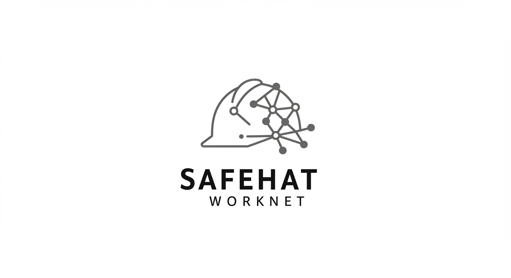
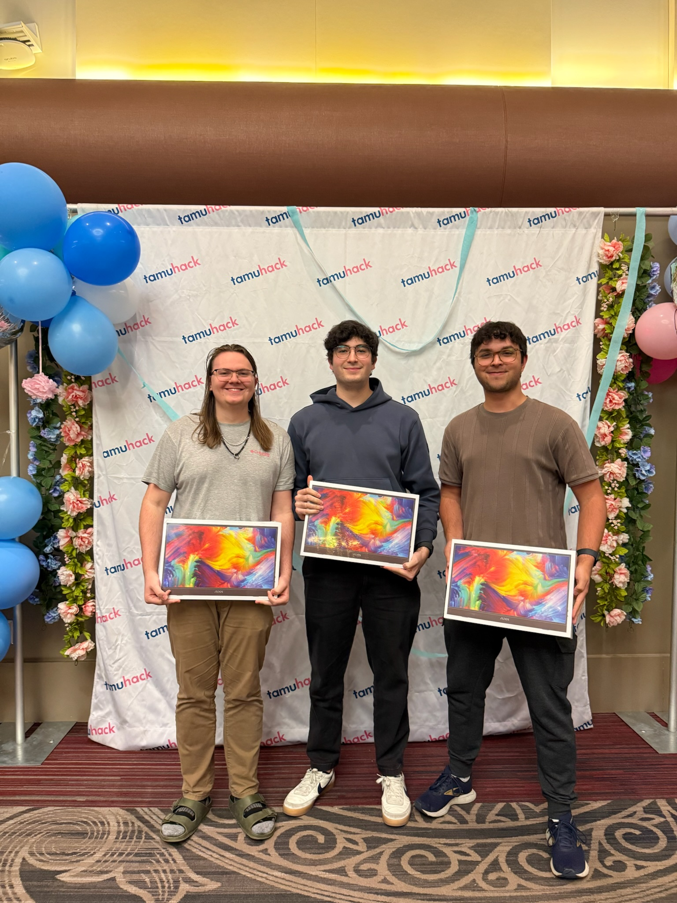

# SafeHat WorkNet: Revolutionizing Workplace Safety with an Easily Deployable IoT Mesh Network

<!-- Project Logo -->

## Award Recognition 🏆

We're thrilled to announce that SafeHat WorkNet won the **IoT Hardware Hack** award at **TAMUHACK25**!

## The Team

| Member | Role & Contributions | LinkedIn |
|--------|---------------------|----------|
| Cesar Magana | Software Engineer - ESP32 Mesh Network & Data Serialization | [LinkedIn Profile](https://linkedin.com/in/cesarmagana2002) |
| Brighton Sikarskie | Hardware Engineer - Sensor Integration & Mesh Network Development | [LinkedIn Profile](https://www.linkedin.com/in/bsikar/) |
| Samuel Bush | Software Engineer - Server & Dashboard Development | [LinkedIn Profile](https://www.linkedin.com/in/samuelkbush/) |

**Project Overview**

SafeHat WorkNet is an innovative safety helmet system designed to enhance worker protection in hazardous environments like construction sites, industrial plants, and mines. This project leverages the power of IoT, a **self-healing ESP32-based mesh network**, and real-time data monitoring to create a comprehensive safety solution that is **easily deployable** using a portable Raspberry Pi network.

**Our Mission**

*   **\[Specific Problem]:** Address a critical safety challenge faced in the target industry (e.g., lack of real-time hazard awareness, delayed emergency response, etc.).
*   **\[Solution Approach]:** SafeHat WorkNet provides **real-time hazard alerts and tracking** using a self-healing mesh network for **rapid response** capabilities. Emphasize the hackathon's theme if applicable.
*   **\[Impact]:** Highlight the potential positive impact on worker safety, incident prevention, and industry standards. We aim to reduce workplace accidents and improve emergency response times.

---

## Features

### 1. Advanced Environmental and Positional Sensing

*   **Temperature and Humidity (DHT22):** Monitor worksite conditions to prevent heat stress.
*   **Gas Sensor (MQ135):** Detect hazardous gas levels (CO2, etc.) with configurable thresholds.
*   **Light Sensor (BH1750):** Assess ambient light for visibility optimization.
*   **Accelerometer and Gyroscope (MPU6050):** Detect falls, impacts, or irregular movements, triggering alerts.
*   **Magnetometer (QMC5883L):** Provides heading information.

### 2. Self-Healing Mesh Network (ESP32)

*   **Robust, Decentralized Communication:** Creates a reliable network between helmets, ensuring continuous data flow even if some nodes fail. **(H2H - Helmet-to-Helmet Communication!)**
*   **Fault Tolerance:** Automatically reroutes data if a node goes offline, maintaining network integrity.
*   **Dynamic Root Node Selection:** Intelligently elects a "root node" based on signal strength (RSSI). The root node is likely responsible for relaying data within the mesh. If the root node fails or its signal weakens, a new root node is dynamically elected.
*   **Scalability:** Easily add more helmets to the network.
*   **Bridge Node Election:** Dynamically selects a node with optimal server connectivity to act as a gateway to the Raspberry Pi server.
*   **Custom Communication Protocol:** We developed a custom JSON serialization protocol for efficient data transfer between nodes and the server. This protocol includes RSSI values and sensor readings, enabling location approximation and optimized for low-bandwidth mesh networks. Each node broadcasts its data, which is collected and processed by the dynamically elected root node.

### 3. Real-Time Alerts and Monitoring

*   **Onboard LED:** Visual indicator of alerts and status.
*   **Centralized Dashboard:** (See "Dashboard" section below) Provides a live overview of worker status, environmental conditions, and approximate locations.
*   **Server Communication:** Bridge nodes relay data to a central server (Flask-based) for data logging, analysis, and rapid response coordination.

### 4. Data Logging and Analysis (Server)

*   **Database Storage (SQLite):** Stores sensor data, events, and location approximations for analysis.
*   **API Endpoints:** Enables data retrieval for monitoring and integration with other systems.

### 5. Interactive Dashboard (Flask)

*   **Real-time Visualization:** Displays sensor data in interactive charts (Chart.js) for easy monitoring.
*   **Node Status Overview:** Tracks the status of each helmet/node in the mesh network.
*   **Event Log:** Records alerts, warnings, and other significant events.

### 6. Easily Deployable with Raspberry Pi

*   **Portable Server:** The system is designed to work with a portable Raspberry Pi server, making it ideal for temporary worksites or locations with limited infrastructure.
*   **Local Operation:** Operates independently on a local network, enhancing data security and eliminating the need for constant external network access.

---

## Applications

*   **Construction Sites:** Enhance safety by monitoring environmental hazards, worker movements, and enabling rapid emergency response.
*   **Industrial Plants:** Provide real-time alerts and monitoring in high-risk areas.
*   **Mining Operations:** Improve safety in confined spaces with gas detection, fall monitoring, and location approximation.
*   **Emergency Response:** Equip first responders with SafeHat for situational awareness and improved coordination.
*   **Incident Analysis:** Review historical data to understand incidents and improve safety protocols.

---

## Technology Stack

*   **Hardware:** ESP32 Microcontrollers, DHT22, MQ135, BH1750, MPU6050, QMC5883L sensors, Raspberry Pi (for server).
*   **Firmware:** C++ (PlatformIO), painlessMesh library.
*   **Server:** Python (Flask), SQLAlchemy (for database interaction).
*   **Dashboard:** HTML, CSS, JavaScript, Chart.js.
*   **Database:** SQLite.
*   **Network:** Ad-hoc mesh network (ESP32), Wi-Fi (for Raspberry Pi server).
*   **Sensor Drivers:** Custom-built using `esp-idf` (not Arduino libraries).

---

## Challenges and Solutions

*   **\[Challenge 1]:** Achieving reliable communication in a dynamic, potentially obstructed environment.
    *   **\[Solution]:** Implemented a self-healing mesh network using ESP32s and the painlessMesh library, featuring dynamic root node selection and H2H communication.
*   **\[Challenge 2]:** Real-time data processing, visualization, and location approximation.
    *   **\[Solution]:** Developed a Flask-based server with API endpoints, an interactive dashboard using Chart.js, and implemented location approximation using the Shannon-Hartley theorem based on RSSI values.
*   **\[Challenge 3]:** Power optimization for extended use.
    *   **\[Solution]:** (Describe the power-saving strategies you implemented or planned to implement, e.g., optimized data transmission intervals, sleep modes).
*   **\[Challenge 4]:** Ensuring accurate sensor readings in a noisy environment.
    *   **\[Solution]:** (Describe any calibration or filtering techniques you used, e.g., calibration of the MQ135 sensor, filtering of accelerometer data).
*   **\[Challenge]:** Developing efficient and reliable communication on a resource-constrained mesh network.
    *   **\[Solution]:** Created a custom JSON serialization protocol for data transfer, optimizing bandwidth usage and enabling features like RSSI-based location approximation.
*   **\[Challenge]:** Implementing sensor drivers from the ground up for greater control and optimization.
    *   **\[Solution]:** Developed custom sensor drivers using `esp-idf`, bypassing the need for potentially less efficient Arduino libraries.

---

## Location Approximation

SafeHat WorkNet is designed to provide approximate location information for each helmet, even without GPS. This is achieved through the following:

*   **RSSI-Based Triangulation:** The system leverages the Received Signal Strength Indicator (RSSI) values between helmets in the mesh network. Stronger RSSI values generally indicate closer proximity.
*   **Shannon-Hartley Theorem:** We plan to incorporate the Shannon-Hartley theorem to further refine location estimates by considering factors like signal-to-noise ratio.
*   **Localized Alert Propagation:** A key application of location approximation is to enable localized alerts. When a hazard is detected by a helmet (e.g., high gas concentration), the alert can be propagated to other helmets within a certain RSSI range, providing immediate warnings to nearby workers.

---

## Future Upgrades

*   **GPS Integration:** Add GPS modules for precise location tracking.
*   **Onboard Communication:** Integrate speakers and microphones for two-way voice communication between helmets.
*   **Further Sensor Integration:** Expand the range of sensors to monitor other environmental factors or worker biometrics.
*   **Machine Learning:** Implement ML models for predictive hazard analysis, personalized safety recommendations, and improved location accuracy.
*   **Cloud Connectivity:** Migrate the server to a cloud platform for scalability, remote access, and data backup.
*   **Dashboard Visualization:** Visualize the approximate locations of helmets on the dashboard, providing a spatial overview of the workforce.

---

## License

This project is licensed under the MIT License. See the [LICENSE](LICENSE) file for more details.

---

## Acknowledgments

*   ESP32 Community and painlessMesh library developers.
*   Open-source sensor library contributors.

---

## Demo Video

## Hackathon Judging Presentation

